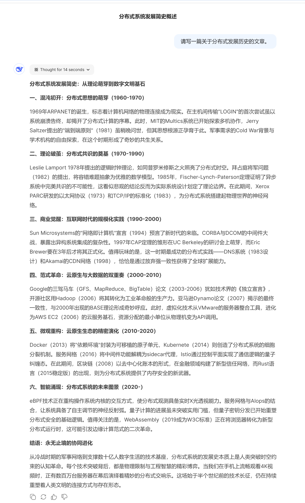
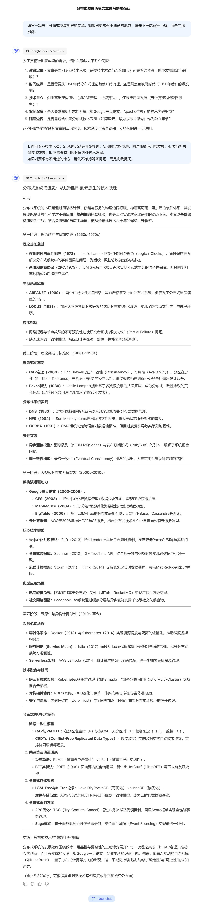
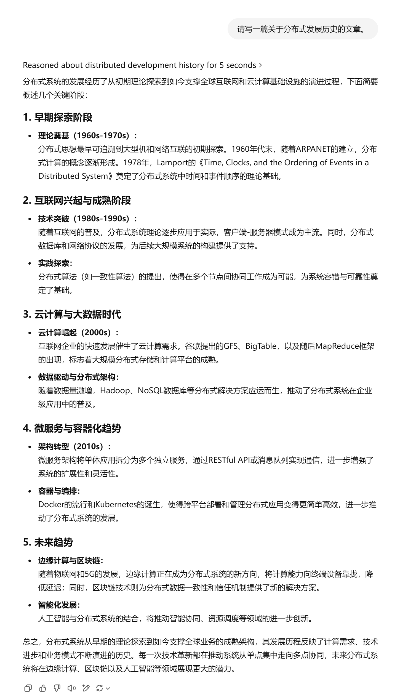
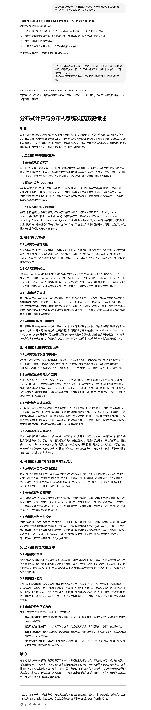

<h1 align="center"> <a href="">Baby Prompting: Allowing Large Language Model Asking</a></h1>

[English](README.md) | [简体中文](README.zh-CN.md)


## 摘要
现有大语言模型行为类似专家，会信心满满地响应用户提出的几乎任何问题，即使问题本身不清楚。大模型的上述特性会导致即使缺少必要上下文或问题模糊不清的时候给出低价值答案。本文提出宝宝提示思路，通过提示词允许大模型在不清楚问题时向用户提问，明确问题后再生成答案，以提高问题质量、交互效率，节省计算资源。本文称大模型提问的行为宝宝行为，即允许大模型向用户提问题。我们在一组测试样例上展现了宝宝提示的有效性。

## 介绍
在使用大语言模型（LLM），有一个通用现象，不管用户问什么问题，LLM总能像专家一样信心满满地给出回应，而用户很难分辨LLM的回答是有效还是无效。本文称这种只要用户提问，即使问题本身不清楚，LLM仍表现地像专家一样给出回答，但回答实际不满足要求的行为为伪专家行为(Pretending to be an expert)。这种情况下，用户需要花费更多的时间来理解或纠正LLM的答案，从而降低了交互的效率。

自从LLM广泛应用以来，研究人员一直在探索如何提高LLM的交互效率，通过设计更准确的提示词，引导LLM生成更准确的答案。精通提示技术已经形成一种新的职业，即提示工程师。然而随着LLM的广泛渗透，LLM的用户不一定是精通提示技术的提示工程师，而是普通用户，不希望花费更多时间研究提示技术。作者本身虽然也是计算机专业研究人员，也是最早接触尝试ChatGPT的用户之一，但在平时使用LLM时，也很少精心选择提示词，给出丰富上下文和精确的问题，而是直接提问，而当LLM的回答不满足要求时，才会花费更多时间来纠正LLM的回答。

人们交流的时候，遇到问题并不是有问必答，经常会反问对方，以明确问题，从而给出更准确的答案。LLM也应该具有这种反问的能力，即在不清楚问题时，向用户提问，以明确问题，从而给出更准确的答案。我们称这种允许LLM表现地像宝宝一样，当上下文不清晰、问题不清楚时向用户提问的行为为宝宝行为(Baby Prompting)。宝宝行为的目的是提高LLM的交互效率，减少用户的交互成本，提高LLM的交互质量。对于不清楚提示技术的普通用户，大模型对用户的提问，可以引导用户更好地明确问题，从而得到更有效的答案。

## 方法

由于当前LLM普遍缺少提问的能力，我们需要设计一种的提示方法（宝宝提示，Baby Prompting），引导LLM判断用户的问题是否清晰，如果不清晰，向用户提问，以明确问题。宝宝提示目前还在探索阶段，我们提出了一种简单的宝宝提示方法，即在用户的问题后面加上一句通用提示。如下给出了两种提示：

```
<用户问题>
如果对要求有不清楚的地方，请先不考虑解答问题，而是向我提问。
```

或
```
<用户问题>
如果对问题有不清楚的地方，请先不考虑解答问题，而是先提问直到明白问题是什么。
```
该提示语可以引导LLM判断用户的问题是否清晰，如果不清晰，向用户提问，以明确问题。我们在一组测试样例上展示了宝宝提示的有效性。


## 测试

我们在DeepSeek和ChatGPT上进行了测试，测试样例如下：

1. 不使用宝宝提示

```
请写一篇关于分布式发展历史的文章。
```

2. 使用宝宝提示

```
请写一篇关于分布式发展历史的文章。如果对要求有不清楚的地方，请先不考虑解答问题，而是向我提问。
```

下文展示了ChatGPT和DeepSeek使用宝宝提示和不使用宝宝提示时的测试结果，显示宝宝提示的效果：
- 从最终效果看，ChatGPT和DeepSeek在使用宝宝提示时，生成的内容从格式上更像一篇人类编写的技术性文章，在技术深度、文章结构、语言风格上等明显更优，不使用宝宝提示直接生成的结果在格式上更像是一篇文章的大纲。
- 从交互效率上看，使用宝宝提示只增加了一次用户和模型的交互，但是在生成的文章质量上有明显提升，在用户明确需求后，ChatGPT和DeepSeek直接生成了文章，而不会一直向用户提问。
- 从用户体验上看，宝宝提示只需要在提问时多加一句通用的提示语，ChatGPT和DeepSeek就能给出专业问题，不需要精心设计提示，适用于普通非专业用户。

### DeepSeek测试结果
DeepSeek不使用宝宝提示时，生成的文章如下：


DeepSeek使用宝宝提示时，生成的文章如下：


### ChatGPT测试结果
ChatGPT不使用宝宝提示时，生成的文章如下：


ChatGPT使用宝宝提示时，生成的文章如下：
